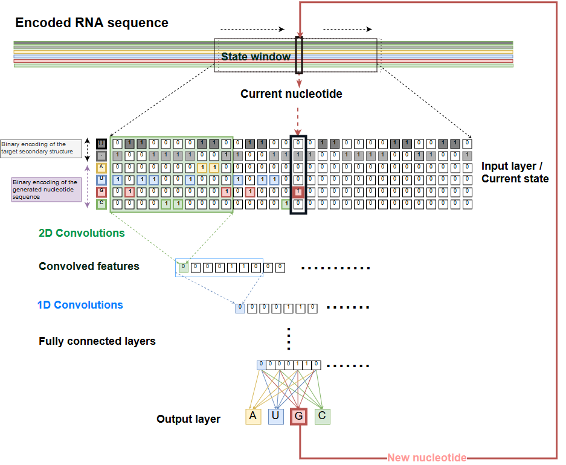

# RLIF - RNA Inverse Folding with Reinforcement Learning

This *Python* package contains:
1. A reinforcement learning based algorithm for RNA inverse folding (78/100 structures solved on the [*Eterna100*](https://eternagame.org/) benchmark).
2. A graphical interface for RNA design and analysis that integrates *RLIF* with *[ViennaRNA](https://www.tbi.univie.ac.at/RNA/)* package.
3. A command line interface for generating solutions for RNA secondary structures.


 

*GUI of RLIF.*

---


## Installation:

All the dependencies can be installed by creating a new conda environment from the *rlif.yml* file and installing the *rlif* python package:

```bash
git clone https://github.com/andriusbern/rlif
cd rlif
conda env create -f rlif.yml
conda activate rlif
pip install -e .
```

# Requirements:

- *Conda* is required to install this package with the following dependencies:

  1. ViennaRNA==2.4.14
  2. Python=3.6
  3. mpi4py

- The following *Python* packages are required:

  1. numpy==1.17.1
  2. tensorflow==1.13.1
  3. stable-baselines==2.7.0
  4. pyyaml
  5. gym
  6. forgi
  7. tqdm
  8. PySide2
  9. pyqtgraph
  10. matplotlib


## Usage

### Graphical User Interface

To launch a *Qt* based interface:

```bash
python rlif/GUI.py
```

Target secondary RNA structures can be entered using the following methods:

1. Sequence editing field (either nucleotide sequences or secondary structures in dot-bracket notation).
2. Loading a *FASTA* file containing RNA sequences. Their secondary structures will be predicted using *ViennaRNA* and can then be used as targets for the algorithm.
3. Loaded from a benchmark dataset (using the dataset selection and *Load dataset* button).

### Command line

To launch a command line interface:
```
python rlif/CLI.py
```

## Graphical representation of the state and action spaces of the RL model

