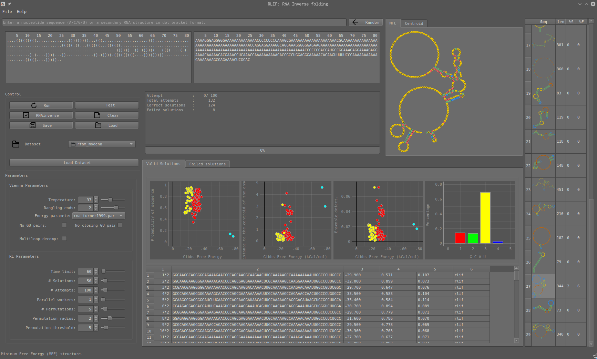

# RLIF

 

This package contains:
1. A reinforcement learning based algorithm for RNA inverse folding.
2. A graphical interface for RNA design and analysis.
3. A command line interface for generating solutions for RNA secondary structures.


## Benchmarks:

**Eterna100**: 78/100

 

# Requirements:

1. Conda
2. ViennaRNA
3. Python==3.7
4. pip:
   1. Base: 
      1. numpy==1.17.1
      2. tensorflow==1.13.1
      3. stable-baselines==2.7.0
      4. pyyaml==3.13
      5. gym
      6. forgi
      7. tqdm
   
   2. GUI version:
      1.  PySide2
      2.  pyqtgraph
      3.  matplotlib


# Installation:

```
conda env create -f rlif.yml
conda activate rlif
pip install -e .
```

# Usage

1. For the graphical user interface:
2. 
```
python rlif/GUI.py
```

1. RNA structures can be either created through keyboard input in the sequence edit field (either nucleotide sequences or secondary structures in dot-bracket notation), loaded from log/fasta files from or chosen from a dataset selection box.


2. For the command line interface of RLIF:

```
python rlif/CLI.py
```

3. To see how the model generates the sequences (the images represent the current solution and are used as input for the reinforcement learning model):

```
python rlif/utils/env_test.py
```

4. To run a test on 3 benchmark datasets, 60 seconds each:

```
python rlif/utils/benchmarks.py -t 60 
```
